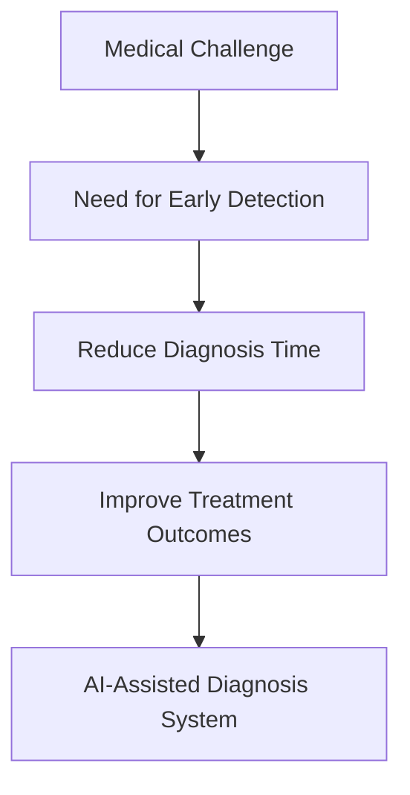
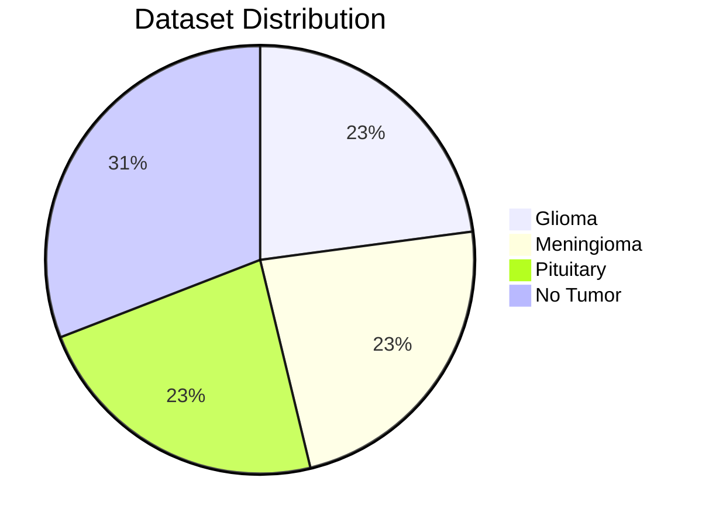
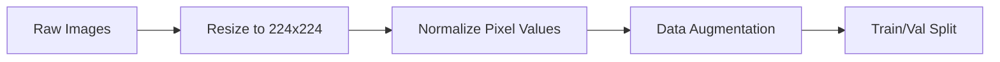
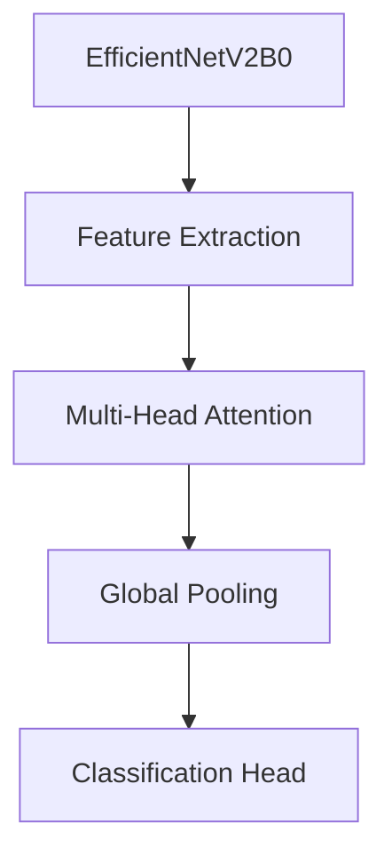
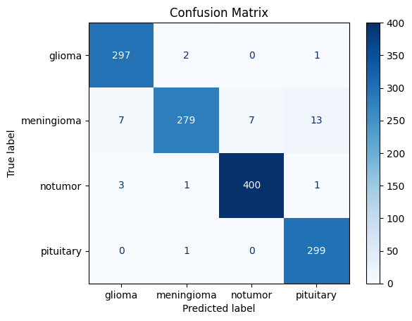
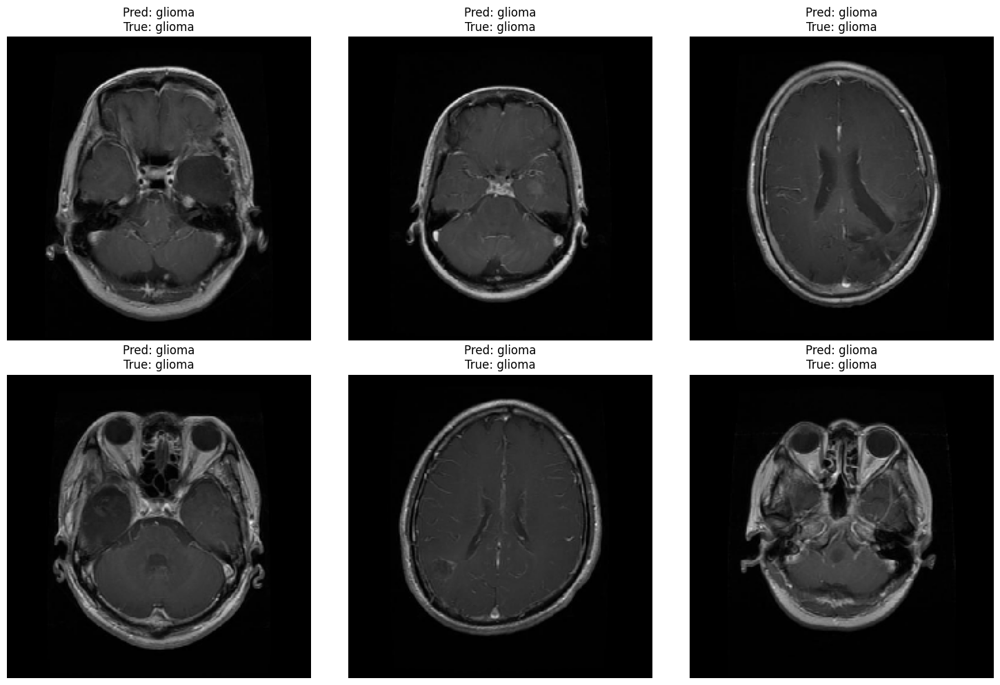

# Brain Tumor Detection

## Project Overview

This project implements a deep learning solution for detecting brain tumors from MRI scans. The system classifies MRI images into four categories: glioma, meningioma, pituitary tumor, and no tumor. The model achieves 97% accuracy on the test set, demonstrating strong performance in medical image classification.

## CRISP-DM Methodology

### 1. Business Understanding



**Objective:** Develop an accurate AI system to assist radiologists in detecting brain tumors from MRI scans, reducing diagnosis time and improving patient outcomes.

**Success Criteria:**

- Achieve >95% classification accuracy
- Support four tumor classi

fications

- Provide interpretable results for medical professionals

### 2. Data Understanding



**Dataset:** Brain Tumor MRI Dataset from Kaggle

- Training set: 5712 images
- Testing set: 1311 images
- Classes: 4 (glioma, meningioma, pituitary, no tumor)
- Image format: MRI scans in JPG format

### 3. Data Preparation



**Preprocessing Steps:**

- Image resizing to 224×224 pixels
- Pixel value normalization (0-1 range)
- Data augmentation for training set:
  - Random rotations
  - Horizontal flips
  - Zoom variations
- 80/20 train-validation split

### 4. Modeling



**Model Architecture:**

- Base Model: EfficientNetV2B0 (pretrained on ImageNet)
- Custom Additions:
  - Multi-head attention layer (4 heads)
  - Global average pooling
  - Dense classification layer with softmax

\*_Training Configuration:_

- Optimizer: AdamW (lr=3e-4, weight_decay=1e-5)
- Loss: Categorical Crossentropy
- Batch Size: 32
- Epochs: 100 (early stopping)
- Callbacks:
  - Early stopping (patience=15)
  - Learning rate reduction (factor=0.5, patience=7)

### 5. Evaluation

```mermaid
xychart-beta
    title "Classification Metrics"
    x-axis "Classes" [Glioma, Meningioma, No Tumor, Pituitary]
    y-axis "Precision / Recall" 0 --> 1
    bar [0.5, 0.5, 0.5, 0.5]
    bar [0.99, 0.91, 0.99, 1]
    bar [0.97, 0.99, 0.98, 0.95]


```



**Performance Metrics:**

- Overall Accuracy: 97%
- Precision: 97% (macro avg)
- Recall: 97% (macro avg)
- F1-Score: 97% (macro avg)

**Detailed Classification Report:**
| | precision | recall | f1-score | support |
| ------------ | --------- | ------ | -------- | ------- |
| glioma | 0.97 | 0.99 | 0.98 | 300 |
| meningioma | 0.99 | 0.91 | 0.95 | 306 |
| notumor | 0.98 | 0.99 | 0.99 | 405 |
| pituitary | 0.95 | 1.00 | 0.97 | 300 |
| | | | | |
| accuracy | | | 0.97 | 1311 |
| macro avg | 0.97 | 0.97 | 0.97 | 1311 |
| weighted avg | 0.97 | 0.97 | 0.97 | 1311 |

### 6. Setup and Installation\*\*

**File Structure**

```
ML_project/
├── Test_dataset/             		# Test images organized by tumor type (for evaluation)
│   ├── glioma                		# Glioma tumor images
│   ├── meningioma/           		# Meningioma tumor images
│   ├── no tumor/             		# Images without tumors
│   ├── pituitary/            		# Pituitary tumor images
├── api/                      		# Backend API
│   ├── api.py                		# Flask API that loads and serves the brain tumor detection model
│   ├── brain_tumor_model.h5  		# Trained brain tumor detection model (HDF5 format)
├── app/                      		# Application files
│   ├── app.py                		# Streamlit-based web UI for tumor detection
├── model/                    		# Trained model files
│   ├── brain_tumor_detection.py    # Python script to build, train, and test the brain tumor detection model
└── README.md                # Project documentation
```

### Local Installation

1. **Clone the repository**:

```bash=
git clone https://github.com/MedRiadh2001/ML_project.git
cd ML_project
```

2. **Create a virtual environment**:

```bash
python -m venv venv
source venv/bin/activate  # On Windows: venv\Scripts\activate
```

3. **Train the models**:

```bash
cd model
python brain_tumor_detection.py
```

4. **Run the API locally**:

```bash
cd api
python api.py
```

5. **Run the Streamlit app locally**:

```bash
streamlit run app/app.py
```

### 7. Deployment\*\*

In Progress ...

### 8. Results Visualization\*\*

**Confusion Matrix**


**Sample Predictions**


**Future Improvements**

- Incorporate 3D MRI volumes for more comprehensive analysis
- Add segmentation capability to localize tumors
- Implement uncertainty quantification for predictions
- Develop DICOM compatibility for clinical integration
